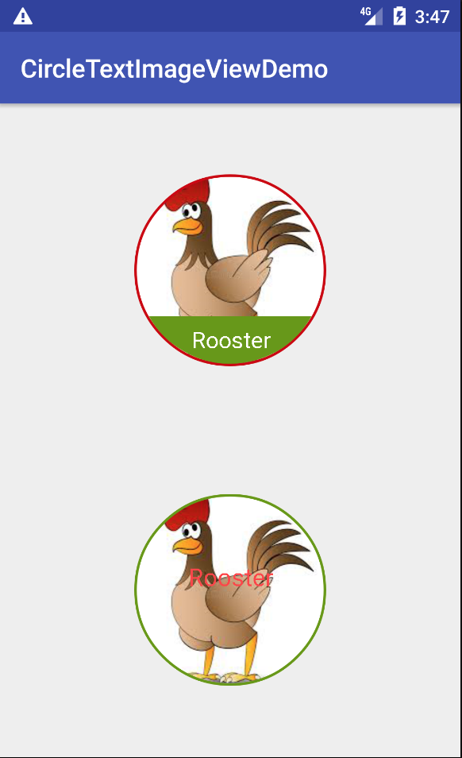

CircleImageView
===============

## Description
This is an Android Image View extention which can help to create circle image view with

1. Border (border width, border color)

2. Center Text (change Text Color, Size, etc)

3. Bottom Text (bottom text lable with specified background color (change text size, text color, background color, etc)

	
	

## Attributes for CircleTextImageView

Atrribute     		| Description			       | Equals
--------------------| -------------------------| --------------------
ctiv\_border_width  | define the border width| setBorderWidth(int borderWidth)
ctiv\_border_color  | define the border color| setBorderColor(@ColorInt int borderColor)
ctiv\_border_overlay | if allow border overlay  | setBorderOverlay(boolean borderOverlay)
ctiv\_circle\_background_color| define the circle background color| setCircleBackgroundColor(@ColorInt int circleBackgroundColor)
ctiv\_center\_text\_color| define center text color | setCenterTextColor(@ColorInt int textColor)
ctiv\_center\_text_size| define center text size | setCenterTextSize(int sp)
ctiv\_center_text | define center text content | setCenterText(String content)
ctiv\_center\_text_offset | define the offset to the center of the circle | setCenterTextOffset(int offset)
ctiv\_bottom\_text_color | define the bottom text color | setBottomTextColor(@ColorInt int textColor)
ctiv\_bottom\_text_size | define the bottom text size | setBottomTextSize(int sp)
ctiv_bottom_text_background | define the background color for text label | setBottomBackgroundColor(@ColorInt int backgroundColor)
ctiv_bottom_text | define the bottom text content | setBottomText(String content)
ctiv_bottom_text_paddingTopBottom | define the top/bottom padding for text label | setmBottomTextPaddingTopBottom(int padding)

## Usage
### Gradle:
```
compile 'cn.tenmaxtech:CircleTextImageView:1.0.2'
```

### Maven:
```
<dependency>
  <groupId>cn.tenmaxtech</groupId>
  <artifactId>CircleTextImageView</artifactId>
  <version>1.0.2</version>
  <type>pom</type>
</dependency>
```

### Ivy
```
<dependency org='cn.tenmaxtech' name='CircleTextImageView' rev='1.0.2'>
  <artifact name='CircleTextImageView' ext='pom' ></artifact>
</dependency>
```
### XML
```
<cn.tenmaxtech.circletextimageview.CircleTextImageView
        xmlns:app="http://schemas.android.com/apk/res-auto"
        android:layout_width="100dp"
        android:layout_height="100dp"
        android:src="@mipmap/ic_launcher"
        app:ctiv_border_color="@android:color/holo_red_dark"
        app:ctiv_border_width="2dp"
        app:ctiv_bottom_text="words"
        app:ctiv_bottom_text_size="13sp"
        app:ctiv_bottom_text_background="@android:color/darker_gray"
        app:ctiv_bottom_text_paddingTopBottom="10dp"/>
```

## TODO
* use StaticLayout to handle multiple lines text for both center text and bottom text
* implement Text-related configuration (TextAligment/Font/etc) for both center text and bottom text

## References
* This library is based on [CircleImageView](https://github.com/hdodenhof/CircleImageView) from [Henning Dodenhof](https://github.com/hdodenhof)
